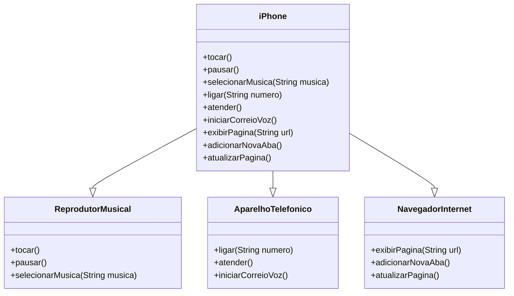

# Desafio: Modelagem e Diagramação de um Componente iPhone

Este projeto tem como objetivo modelar e implementar um componente `iPhone` em Java, que inclui as funcionalidades de Reprodutor Musical, Aparelho Telefônico e Navegador na Internet. O projeto também conta com um diagrama UML para ilustrar a estrutura de classes e interfaces.

## Diagrama UML

O diagrama abaixo representa a modelagem UML do componente `iPhone`, que implementa as interfaces `ReprodutorMusical`, `AparelhoTelefonico` e `NavegadorInternet`.

Funcionalidades Implementadas
Reprodutor Musical
- tocar(): Inicia a reprodução de música.
- pausar(): Pausa a reprodução.
- selecionarMusica(String musica): Seleciona uma música para reprodução.

Aparelho Telefônico
- ligar(String numero): Liga para um número de telefone.
- atender(): Atende uma chamada telefônica.
- iniciarCorreioVoz(): Inicia o correio de voz.

Navegador na Internet
- exibirPagina(String url): Exibe uma página web.
- adicionarNovaAba(): Adiciona uma nova aba no navegador.
- atualizarPagina(): Atualiza a página web atual.

Estrutura do Projeto
O projeto contém as seguintes interfaces e classes:

Interfaces:
- ReprodutorMusical: Define métodos relacionados à reprodução de música.
- AparelhoTelefonico: Define métodos relacionados a funções de telefone.
- NavegadorInternet: Define métodos relacionados à navegação na web.

Classe:
- iPhone: Implementa todas as funcionalidades definidas pelas interfaces mencionadas.
